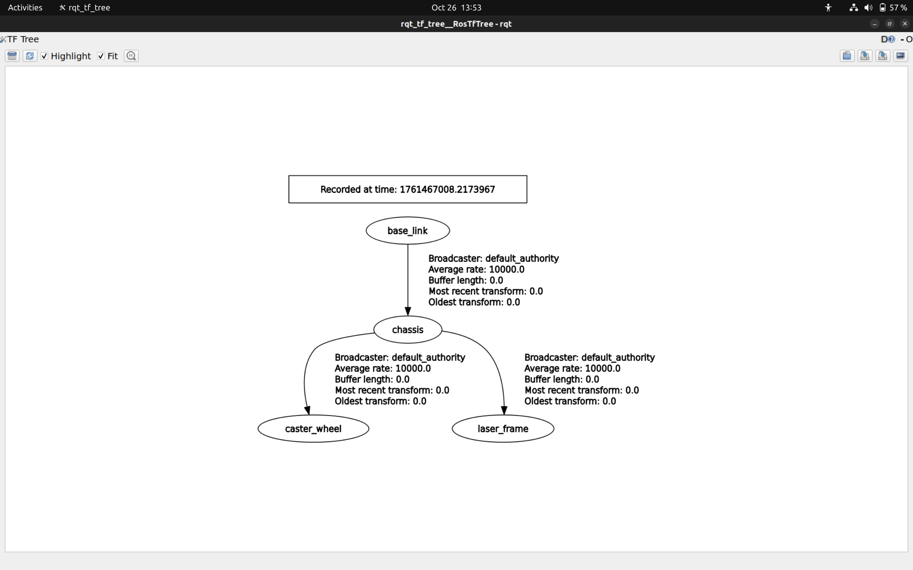
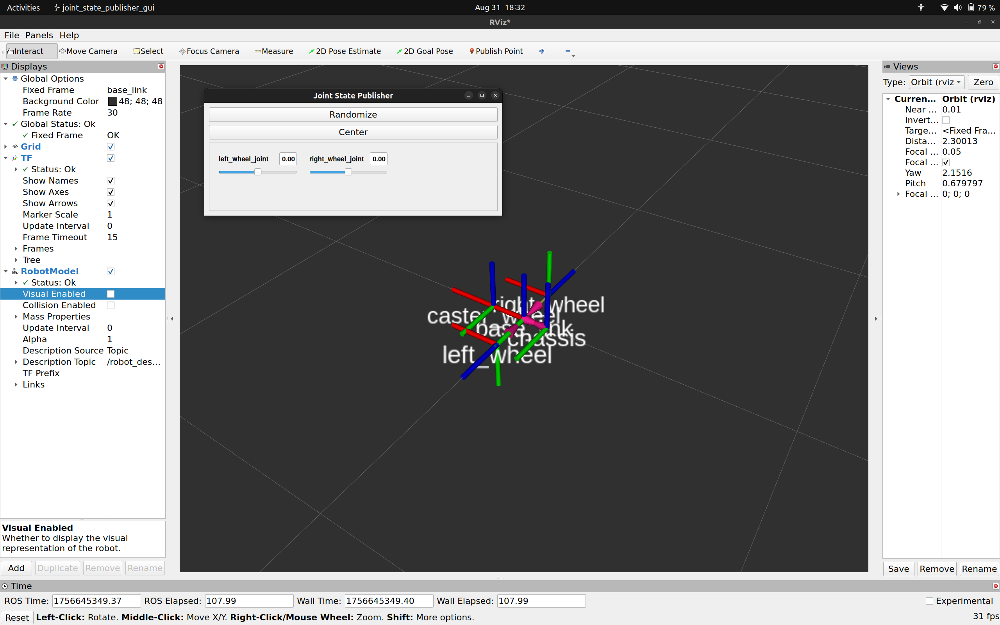
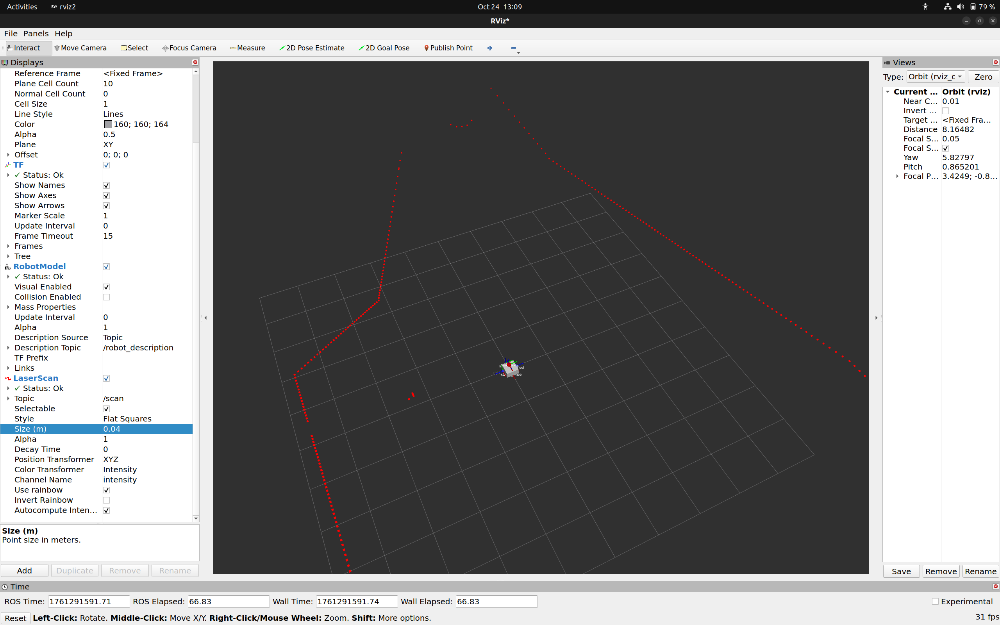

## Gazebo RL Nav — Reinforcement-Learning Based Autonomous Navigation (ROS2 + Gazebo)

A ROS2 package that wraps a simulated differential-drive robot in Gazebo as a custom **Gymnasium** environment, and trains a **PPO** (Stable-Baselines3) agent to navigate to a goal while avoiding obstacles using LiDAR data.

> Replace `<your-repo-name>`, badges, and the placeholders marked `[ADD: ...]` below before publishing.


---

## Overview

This project explores learning-based local navigation as an alternative to classical planners (A\*/DWA). Instead of hand-tuning a costmap and controller, a differential-drive robot in Gazebo learns a navigation policy end-to-end from raw LiDAR scans, using reward shaping for progress-to-goal, collision avoidance, and stagnation penalties.

The core idea: bridge ROS2 (simulation, sensor topics, control) with the standard Gymnasium `step()`/`reset()` API, so any off-the-shelf RL algorithm (here, PPO) can be trained directly against the Gazebo simulation.

## Demo

| TF Tree                       | Robot in RViz2                           | LiDAR in Gazebo                        |
| ----------------------------- | ---------------------------------------- | -------------------------------------- |
|  |  |  |

| LiDAR scan visualized in RViz2       |
| ------------------------------------ |
|  |

_(Save the four screenshots into a `media/` folder in the repo root with these names, or update the paths above.)_

## Robot Architecture

- **Frame tree:** `base_link → chassis → caster_wheel`, `chassis → laser_frame`
- **Drive:** differential drive, actuated via `left_wheel_joint` / `right_wheel_joint`
- **Sensing:** single planar LiDAR mounted on the chassis, published on `/scan`
- **Description source:** URDF/Xacro, published via `/robot_description` and visualized in RViz2 via `RobotModel` + `joint_state_publisher_gui` for manual joint testing

## RL Environment Design

`GazeboRLEnv` is a ROS2 `Node` that also implements the Gymnasium interface, so `stable_baselines3.PPO` can train against it directly.

| Component                 | Detail                                                                                                                                          |
| ------------------------- | ----------------------------------------------------------------------------------------------------------------------------------------------- |
| **Observation**           | LiDAR range array from `/scan`                                                                                                                  |
| **Action**                | `[linear_velocity, angular_velocity]` sent as `Twist` commands                                                                                  |
| **Reward — progress**     | `+2.0 × distance_moved_toward_goal` per step                                                                                                    |
| **Reward — collision**    | `-10.0`, episode ends, if minimum LiDAR range drops below `collision_threshold`                                                                 |
| **Reward — stagnation**   | `-0.05` per step when movement is negligible (`progress < 0.005`); a stuck-episode-reset penalty is present in code but currently commented out |
| **Reward — goal reached** | `+20.0`, episode ends, when distance to goal `< 0.3 m`                                                                                          |
| **Episode termination**   | Collision, goal reached, or (optionally) stuck-timeout                                                                                          |

A goal marker is published each step (`publish_goal_marker()`) for visualization in RViz2.

### Training

The agent is trained/fine-tuned with **PPO** (`MlpPolicy`) via Stable-Baselines3:

```python
model = PPO(
    "MlpPolicy",
    env,
    verbose=1,
    learning_rate=3e-4,
    clip_range=0.2,
    ent_coef=0.001,
    batch_size=64,
    n_steps=2048,
    gamma=0.99,
)
model.learn(total_timesteps=500_000)
```

If a saved model (`ppo_gazebo_track.zip`) exists, training resumes from it instead of starting from scratch. `stable_baselines3.common.env_checker.check_env` is run first to validate the custom environment against the Gymnasium API contract.

## Tech Stack

- **ROS2** (rclpy) — simulation bridge, topic pub/sub, timers
- **Gazebo** (classic) — physics simulation, LiDAR sensor plugin
- **RViz2** — visualization (TF, robot model, LaserScan, goal markers)
- **Gymnasium** — standard RL environment API
- **Stable-Baselines3 (PPO)** — policy training
- **NumPy**

## Repository Structure

```
<your-repo-name>/
├── gazebo_rl_env/
│   ├── gazebo_env.py        # GazeboRLEnv: ROS2 node + Gymnasium env (step/reset/reward logic)
│   └── nodes/
│       └── scaffold_node.py # early test node (basic pub/sub scaffold, not part of the RL loop)
├── train.py                 # loads/creates PPO model, runs training, saves checkpoint
├── worlds/                  # [ADD: Gazebo world file(s) used]
├── urdf/                    # [ADD: robot URDF/Xacro]
├── media/                   # screenshots used in this README
└── README.md
```

_(Update this to match your actual package layout — this is inferred from the code shared.)_

## Getting Started

### Prerequisites

```bash
# ROS2 [ADD: Humble/Foxy/Jazzy — confirm your distro]
sudo apt install ros-<distro>-desktop gazebo

pip install stable-baselines3 gymnasium numpy --break-system-packages
```

### Build

```bash
cd ~/ros2_ws
colcon build --packages-select gazebo_rl_env
source install/setup.bash
```

### Run the simulation

```bash
ros2 launch gazebo_rl_env <your_world_launch_file>.launch.py
```

### Train the agent

```bash
python3 train.py
```

### Visualize in RViz2

```bash
rviz2
# Add: RobotModel, TF, LaserScan (/scan), Marker (goal)
```

## Results

---


## Limitations & Future Work

- Reward function currently penalizes stagnation but does not hard-terminate stuck episodes (commented out) — worth revisiting for training stability
- Single LiDAR-based observation only; no odometry/IMU fusion in the observation space yet

## Acknowledgments

- [Stable-Baselines3](https://stable-baselines3.readthedocs.io/)
- [Gymnasium](https://gymnasium.farama.org/)
- ROS2 / Gazebo simulation stack
